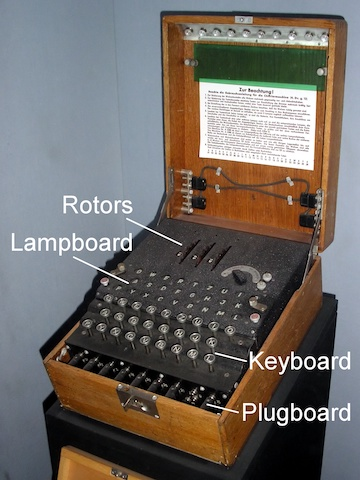

## Week 3 assignment

The Enigma machine is the most famous cipher machine to date. Nazi
Germany used it during World War II to encrypt messages so that
enemies could not understand them.  The story of the British
cryptanalysts who successfully deciphered Enigma has become the
subject of multiple movies *Enigma* (2001); *The Imitation Game*
(2014).  In this exercise, we will focus our attention on a simplified
version of the Enigma machine, which we name "Little Enigma." Like the
real Enigma machine shown in the picture above, this machine consists
of two key components.  First, the Little Enigma machine has 5
different *rotors*, each of which comes with 10 pins with numbers
ranging from 0 to 9. Second, a component called the *plugboard*
contains 26 holes, corresponding to the 26 letters of the alphabet. In
addition, 13 cables connect all possible pairs of letters. Since a
cable has two ends, one can connect, for example, the letter A with
any other of the other 25 letters present in the plugboard.

To either encode a message or decode an encrypted message, one must
provide the Little Enigma machine with a correct five-digit passcode
to align the rotors and a correct configuration of the plugboard. The
rotors are set up just like many combination locks. For example, the
passcode 9--4--2--4--9 means that five rotors display the numbers 9,
4, 2, 4, and 9 in that order.  In addition, the 13 cables connecting
the letters in the plugboard must be appropriately configured. The
purpose of the plugboard is thus to scramble the letters.  For
example, if B is connected to W, the Little Enigma machine will switch
B with W and W with B to encode a message or decode an encoded
message.  Thus, a sender types a message on the keyboard, the
plugboard scrambles the letters, and the message is sent in its
encrypted form.  A receiver decodes the encrypted message by re-typing
it on a paired Little Enigma machine that has the same passcode and
plugboard configuration.

## Question 1

How many different five-digit passcodes can be set out of the 5
rotors?